# 一，流程图

### 	1.图形

```markdown
graph TD
开始 --> 结束
```

graph声明了一个新图形和图形布局的方向
TB - 从上到下
BT - 从下到上
RL - 从右到左
LR - 从左到右
TD - 与TB相同

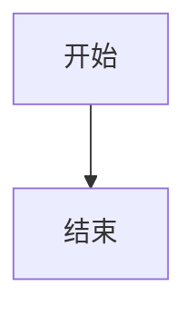


### 2.节点和形状

(1)start				节点
(2)start1[文本节点]	带有文本的节点 
(3)start2(圆边)	具有圆边的节点
(4)start3((圆形))	圆形的节点   
(5)start4>不对称]  不对称节点
(6)start

```markdown
graph LR
	start --> start1[开始] --> start2(开始) --> start3((开始)) --> start4>结束]
```


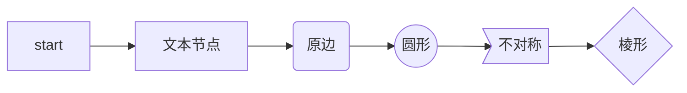

### 3.节点间的连接

（1）-->		带箭头的连接

（2）---		不带箭头的连接

（3）-- 文字 ---	连接上的文字

​		  ---|文字|

（4）-->|文字|	带箭头和文字的连接

​		  -- 文字 -->

（5） -.->		虚线连接

（6）-. 文字 .->   带文字的虚线连接

（7）==>		粗连接

（8）== 文字 ==>		带文本的粗连接

（9）id1["破坏语法的特殊字符"]

（10）A["特殊字符:#9818;"]	实体代码转义字符

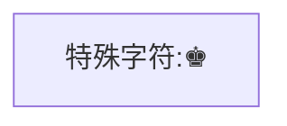

### 4.子图

语法	subgraph title +	end

```markdown

graph TB
	c1-->a2
	subgraph one
	a1 --> a2
	end
	subgraph two
	b1 --> b2
	end
	subgraph three
	c1 --> c2
	end
```

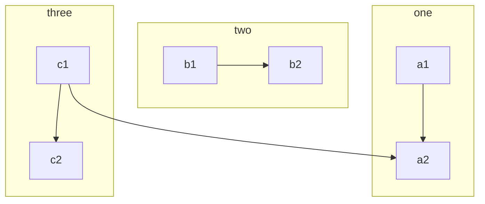

### 5.样式链接

```
graph LR
	id1(start) --> id2(stop)
	style id1 fill:#f9f,stroke:#333,stroke-width:4px
	style id2 fill:#ccf,stroke:#f66,stroke-width:2px,stroke-dasharray: 5,5
```


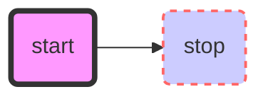


### 6.支持fontawesome

```markdown
graph TD
	B["fa:fa-twitter 和平"]
	B-->C[fa:fa-ban 禁止]
```


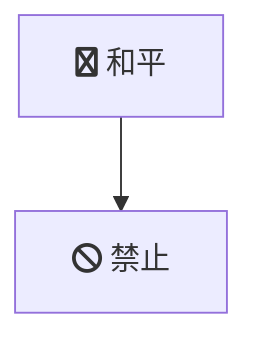


# 二，时序图


```markdown
sequenceDiagram
    participant z as 张三
    participant l as 李四
    loop 日复一日
        z->>l: 吃了吗您呐？
        l-->>z: 吃了，您呢？
        activate z
        Note left of z: 想了一下
        alt 还没吃
            z-xl: 还没呢，正准备回去吃
        else 已经吃了
            z-xl: 我也吃过了，哈哈
        end
        opt 大过年的
            l-->z: 祝您新年好啊
        end
    end
```


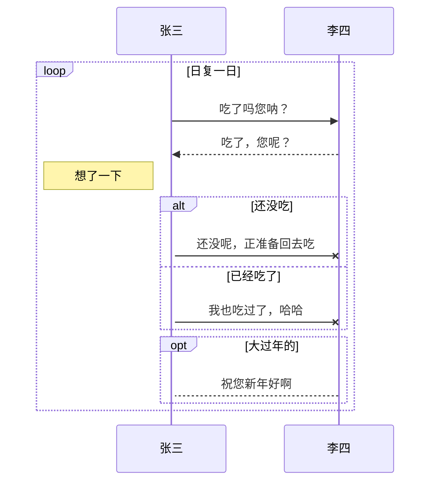


# 三，饼图

```markdown
pie
    title Key elements in Product X
    "Calcium" : 42.96
    "Potassium" : 50.05
    "Magnesium" : 10.01
    "Iron" :  5
```


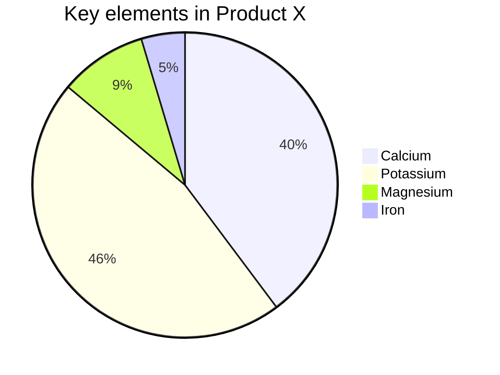

# 四，甘特图

```markdown
gantt
section Section
Completed :done,    des1, 2014-01-06,2014-01-08
Active        :active,  des2, 2014-01-07, 3d
Parallel 1   :         des3, after des1, 1d
Parallel 2   :         des4, after des1, 1d
Parallel 3   :         des5, after des3, 1d
Parallel 4   :         des6, after des4, 1d
```

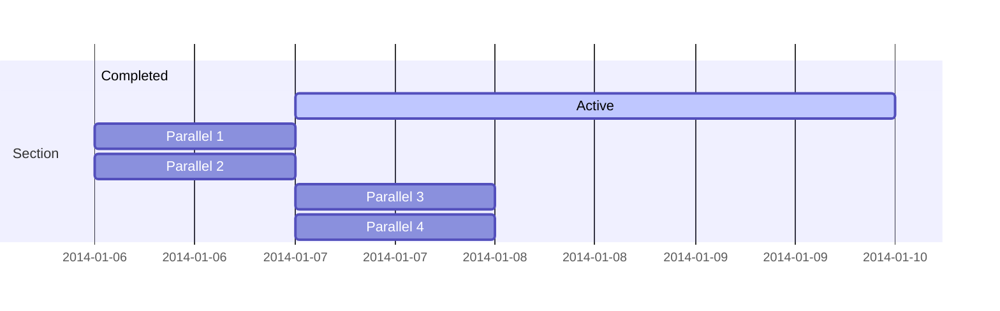

# 五，类图

```markdown
classDiagram
Class01 <|-- AveryLongClass : Cool
<<interface>> Class01
Class09 --> C2 : Where am i?
Class09 --* C3
Class09 --|> Class07
Class07 : equals()
Class07 : Object[] elementData
Class01 : size()
Class01 : int chimp
Class01 : int gorilla
class Class10 {
  <<service>>
  int id
  size()
}
```


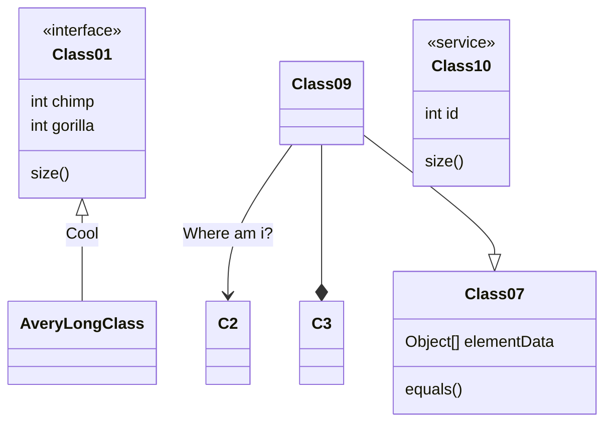

# 六，状态图

```markdown
stateDiagram-v2
[*] --> Still
Still --> [*]
Still --> Moving
Moving --> Still
Moving --> Crash
Crash --> [*]
```

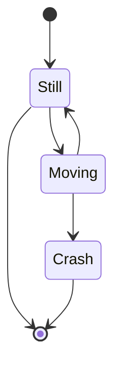


# 七，旅程图

```markdown
  journey
    title My working day
    section Go to work
      Make tea: 5: Me
      Go upstairs: 3: Me
      Do work: 1: Me, Cat
    section Go home
      Go downstairs: 5: Me
      Sit down: 3: Me

```

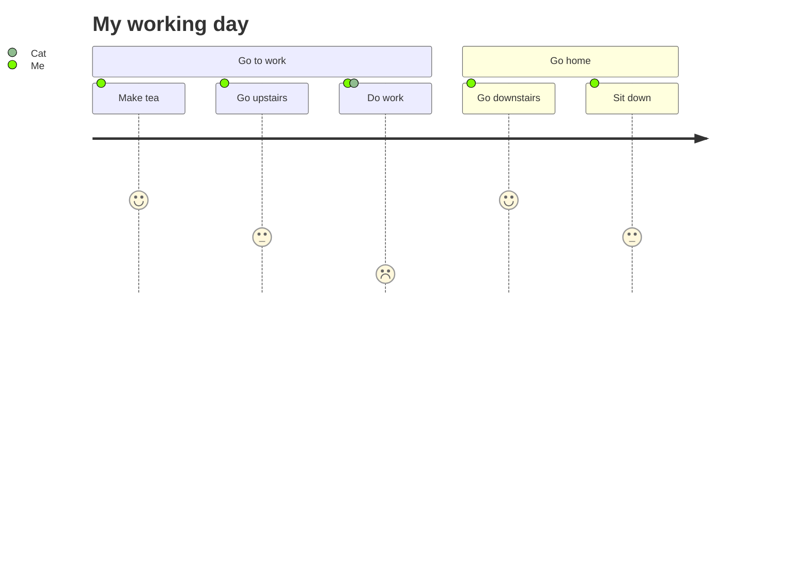

